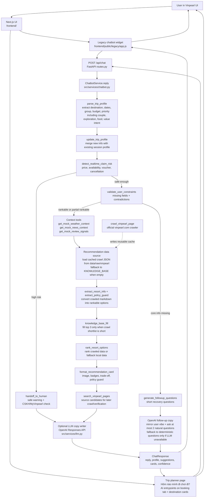

# Vinpearl AI Resort & Package Fit Assistant

Prototype for Track B: Travel & Hospitality.

This project demos an AI-assisted flow for helping first-time or low-confidence Vinpearl travelers choose a suitable resort or package before booking. The assistant asks for a short trip profile, returns a shortlist of matching options, explains trade-offs, shows policy warnings, and asks for clarification or hands off to human support when confidence is low.

## Problem

Vinpearl has many destinations, resorts, packages, vouchers, membership offers, and booking conditions. A family or couple planning a 2-5 day trip can easily get stuck comparing options or worrying about hidden restrictions such as cancellation rules, child surcharge, voucher eligibility, or real-time availability.

The goal of this prototype is not to replace the booking flow. It helps the user make a safer decision before checkout.

## What This Prototype Does

- Collects key trip needs: destination, dates, group type, budget, and travel priority.
- Recommends top 3 resort, package, or activity options.
- Explains why each option fits.
- Shows trade-offs and policy guards.
- Displays confidence instead of pretending all answers are certain.
- Shows image-based recommendation cards in the chatbot.
- Uses cached official Vinpearl crawl data when available, with mock/local fallback for demo reliability.
- Uses mock weather, news, and review signals for prototype context.
- Handles unclear, conflicting, or risky requests by asking follow-up questions or suggesting human support.

## What This Prototype Does Not Do

- It does not book rooms or take payment.
- It does not check real-time room availability.
- It does not confirm exact price, voucher eligibility, cancellation, or refund policy without a source/API.
- It does not log in to MyVinpearl or call private Vinpearl APIs.
- It does not compare live prices with OTA platforms.

## Key User Paths

| Path | Expected behavior |
|---|---|
| Happy path | User gives destination, dates, group, budget, and preference. The assistant returns matching resort/package cards with reason, trade-off, policy guard, confidence, and next step. |
| Low-confidence path | User gives vague input. The assistant asks for missing information instead of guessing. |
| Failure path | User asks for risky or real-time claims such as voucher, cancellation, or availability. The assistant warns that it cannot confirm and suggests checking Vinpearl/MyVinpearl or CSKH. |
| Correction path | User changes destination, budget, group, or preference. The assistant updates the shortlist and explains what changed. |

## Project Structure

```text
src/
  agents/              LangGraph-style agent boundary
    graph.py           Agent graph entry point
    state.py           Agent state schema
    nodes/             Agent node functions
    tools/             Agent tools
  api/                 FastAPI backend routes
    routes.py          API endpoints
  models/              Pydantic schemas
  services/            Business logic and LLM service boundary
  static/              Current frontend prototype UI
  config.py            App settings
  main.py              FastAPI app entry point

frontend/
  src/app/             Next.js App Router pages, layout, and global CSS
  src/components/      React UI components
  src/lib/             Frontend TypeScript types/helpers
  public/assets/       Static image assets served by Next.js

tests/
  test_agents/         Agent tests
  test_api/            API and static-serving tests

scripts/               AI logging helper scripts
docs/                  Technical guide and architecture diagram
eval/                  Evaluation outputs
presentation/          Demo day slides
```

## Requirements

- Python 3.11+ recommended
- `pip`
- Node.js 20+ recommended
- `npm`

The project currently uses:

- FastAPI
- Uvicorn
- Pydantic Settings
- Crawl4AI
- Pytest
- Next.js
- React
- TypeScript
- ESLint

## Run Project Step By Step

Run the backend first, then the Next.js frontend. Keep both terminals open.

### 1. Install Backend

From the project root:

```bash
python -m venv .venv
source .venv/bin/activate
python -m pip install --upgrade pip
python -m pip install -r requirements.txt
```

Prepare Crawl4AI browser dependencies:

```bash
crawl4ai-setup
```

`crawl4ai-setup` prepares the browser dependencies used by the Vinpearl crawler tool.

Optional environment setup:

```bash
cp .env.example .env
```

Put your real API key in `.env` only:

```text
OPENAI_API_KEY="your_real_key_here"
OPENAI_MODEL="gpt-4.1-mini"
LLM_ENABLED="true"
```

Do not commit `.env`.

### 2. Start Backend

From the project root:

```bash
source .venv/bin/activate
python -m uvicorn src.main:app --reload --host 127.0.0.1 --port 8000
```

Check backend:

```text
http://127.0.0.1:8000/api/health
```

Expected response:

```json
{"status":"ok"}
```

### 3. Install Frontend

Open a second terminal:

```bash
cd frontend
npm install
cp .env.example .env.local
```

By default, `frontend/.env.example` points the frontend to:

```text
BACKEND_URL="http://127.0.0.1:8000"
```

### 4. Start Frontend

In the same frontend terminal:

```bash
npm run dev
```

Open the Next.js UI:

```text
http://127.0.0.1:3000/
```

The Next.js frontend proxies `/api/*` to FastAPI using `BACKEND_URL`.

### 5. Normal Development Loop

- Edit backend agent/tools in `src/`.
- Edit Next.js wrapper UI in `frontend/src/`.
- Edit the preserved Vinpearl static UI in `frontend/public/legacy/`.
- If agent behavior or tools change, update the Mermaid diagram in this README.

Useful URLs:

```text
Frontend: http://127.0.0.1:3000/
Backend:  http://127.0.0.1:8000/
Health:   http://127.0.0.1:8000/api/health
```

## Run Tests

```bash
python -m pytest -q
cd frontend
npm run lint
npm run build
```

The test suite currently checks:

- Agent graph returns a valid state.
- API health endpoint works.
- Static homepage is served by FastAPI.
- Vinpearl crawler URL validation and Crawl4AI integration wrapper.

The frontend checks verify TypeScript, ESLint, and production Next.js build.

## Agent Tools

The agent tools live in `src/agents/tools`.

Whenever agent behavior, chatbot flow, or tool wiring changes, update the diagram below in the same change. This diagram is the visual source of truth for how the assistant works.



Current tools:

| Tool | Purpose |
|---|---|
| `search_vinpearl_pages` | Builds official Vinpearl source candidates from keyword, destination, and category. |
| `crawl_vinpearl_page` | Async tool that crawls official `vinpearl.com` pages and returns LLM-ready markdown. |
| `crawl_vinpearl_page_sync` | Sync wrapper for scripts or non-async agent integrations. |
| `load_cached_vinpearl_pages` | Loads cached crawl JSON from `data/raw/vinpearl` when available. |
| `get_mock_weather_context` | Returns mock weather context and UI theme by destination. |
| `get_mock_news_context` | Returns mock travel/news signals by destination. |
| `get_mock_review_signals` | Returns mock review positives and watch-outs by destination. |
| `extract_resort_info` | Extracts destination, amenities, best-fit tags, highlights, and confidence from crawled markdown. |
| `extract_policy_guard` | Extracts cancellation/refund, voucher, child surcharge, restriction, and price/availability warnings. |
| `validate_user_constraints` | Finds missing fields and contradictions in the user's trip profile. |
| `detect_realtime_claim_risk` | Detects risky questions about exact price, availability, voucher, cancellation, or refund. |
| `generate_followup_questions` | Generates short recovery questions for low-confidence inputs. |
| `update_trip_profile` | Applies correction-path changes and reports what changed. |
| `handoff_to_human` | Builds a CSKH/human-review handoff packet for risky cases. |
| `rank_resort_options` | Ranks resort/package options against destination, group, budget, and priority. |
| `format_recommendation_card` | Formats an option into the prototype card contract. |
| `compare_previous_recommendations` | Compares old and new shortlists after user correction. |
| `save_prompt_test_case` | Saves prompt/output evidence to an evaluation JSONL file. |
| `score_agent_response` | Scores an output against the relevance, trust, and recovery rubric. |

The crawler tool is restricted to official `vinpearl.com` URLs. It respects `robots.txt`, returns source metadata, and does not crawl arbitrary external domains.

## Real LLM / API Key

The chatbot supports a real OpenAI API key through `src/services/llm.py`.

The LLM is used only as a response copy writer after deterministic tools have already parsed the profile, checked safety, ranked options, and formatted cards. In follow-up mode, it mirrors the user's travel vibe and asks at most two natural clarification questions; deterministic question lists are only the fallback when the LLM is unavailable. It must not create new options or confirm realtime price, room availability, voucher eligibility, cancellation, refund, or booking.

Configure in `.env`:

```text
OPENAI_API_KEY="your_real_key_here"
OPENAI_MODEL="gpt-4.1-mini"
OPENAI_BASE_URL=""
OPENAI_MAX_OUTPUT_TOKENS="450"
LLM_ENABLED="true"
```

If `OPENAI_API_KEY` is missing, `LLM_ENABLED=false`, the SDK is unavailable, or the provider returns an error, the backend falls back to the rule-based response builder and the app still works.

For OpenAI-compatible providers, set `OPENAI_BASE_URL`. Leave it empty for the official OpenAI API.

Optional crawler settings live in `.env` and are documented in `.env.example`:

```text
VINPEARL_CRAWLER_TIMEOUT_SECONDS=90
VINPEARL_CRAWLER_MAX_MARKDOWN_CHARS=24000
VINPEARL_CRAWL_CACHE_DIR=data/raw/vinpearl
```

## Crawl Data On Demand

`crawl4ai-setup` only prepares browser dependencies. It does not crawl Vinpearl data by itself.

Crawl data only when you want to refresh official source snapshots and the structured Vinpearl catalog:

```bash
source .venv/bin/activate
python scripts/crawl_vinpearl.py
```

By default, the script uses the official Vinpearl menu/catalog captured from `vinpearl.com/vi`, including hotels/resorts by destination, experiences, offers, and news. It then attempts to crawl the corresponding official URLs and saves enriched JSON files to:

```text
data/raw/vinpearl/
```

It also writes:

```text
data/raw/vinpearl/crawl-summary.json
data/raw/vinpearl/catalog-index.json
```

The cached JSON files are intended to be committed and pushed so teammates do not need to crawl every time they run the app.

When cached crawl JSON exists, the chatbot automatically loads it, extracts rankable resort/activity signals, and uses those options before ranking. If the crawl shortlist has fewer than 3 matching cards, the chatbot fills the remaining slots from the built-in `KNOWLEDGE_BASE` so the UI still has a complete top 3. When the cache folder is empty or has no usable JSON, the chatbot falls back to `KNOWLEDGE_BASE` mock/local data so the demo still works.

Useful commands:

```bash
# Crawl specific official Vinpearl pages
python scripts/crawl_vinpearl.py https://vinpearl.com/vi/phu-quoc https://vinpearl.com/vi/nha-trang

# Reuse cache when present, crawl only missing files
python scripts/crawl_vinpearl.py

# Force refresh all seed URLs
python scripts/crawl_vinpearl.py --force

# Write the rich structured catalog without waiting for browser crawling
python scripts/crawl_vinpearl.py --catalog-only --force

# Try to discover extra official links from crawled pages
python scripts/crawl_vinpearl.py --discover-links --max-pages 80

# Give slow Vinpearl pages more time
python scripts/crawl_vinpearl.py --timeout-seconds 120

# Stop immediately when one URL fails
python scripts/crawl_vinpearl.py --fail-fast
```

The crawler writes structured `official_vinpearl_catalog_enriched` cache entries even when a page is slow, blocked, or returns noisy modal text. It continues to the next URL unless `--fail-fast` is set. The running app does not auto-crawl on startup. It only reads usable cached JSON files that already exist in `data/raw/vinpearl`; failed cache entries are ignored by the recommendation loader.

## Run With Docker

Build and start:

```bash
docker compose up --build
```

Open:

```text
http://127.0.0.1:3000/
```

Backend remains available at:

```text
http://127.0.0.1:8000/
```

Stop:

```bash
docker compose down
```

## Frontend Notes

- Next.js lives in `frontend/` so the Python backend and agent code remain under `src/`.
- Static images are served from `frontend/public/assets`.
- The chatbot React component calls `/api/chat`; `frontend/next.config.ts` rewrites that to `BACKEND_URL`.
- `npm audit` currently reports a moderate PostCSS advisory through the installed Next.js dependency. The suggested `npm audit fix --force` would downgrade Next.js to 9.x, so it is intentionally not applied.

## AI Response Contract

Every main assistant response should include:

1. Need summary: destination, group, nights, budget, priority, constraints.
2. Top 2-3 resort/package options: option name, reason, trade-off, confidence.
3. Policy guard: cancellation/refund, voucher/membership, child surcharge, restrictions, possible extra costs.
4. Next action: choose option, answer missing questions, check Vinpearl/MyVinpearl, or contact CSKH/human review.

The assistant must not:

- Auto-book or auto-pay.
- Claim exact price or availability without an API/source.
- Confirm voucher or cancellation policy without enough booking context.
- Suggest options outside the user's hard destination constraint.
- Return generic brochure text or rigid form-like follow-ups without decision support.

## Evaluation Criteria

| Metric | Target |
|---|---|
| Relevance | 4/5 test cases return options matching destination and main constraints. |
| Trust/Safety | 100% of price, policy, voucher, cancellation, and availability answers include confidence or warning. |
| Recovery | 3/3 low-confidence, failure, and correction cases ask follow-up, update the answer, or hand off safely. |

## Demo Script

1. Explain the problem: users struggle to choose a Vinpearl resort/package and worry about policy or hidden restrictions.
2. Show happy path: complete trip profile -> top resort/package recommendations.
3. Show low-confidence path: vague request -> assistant asks missing questions.
4. Show failure path: risky real-time claim -> assistant refuses to confirm and suggests verification/handoff.
5. Show correction path: user changes destination or priority -> assistant updates the shortlist.
