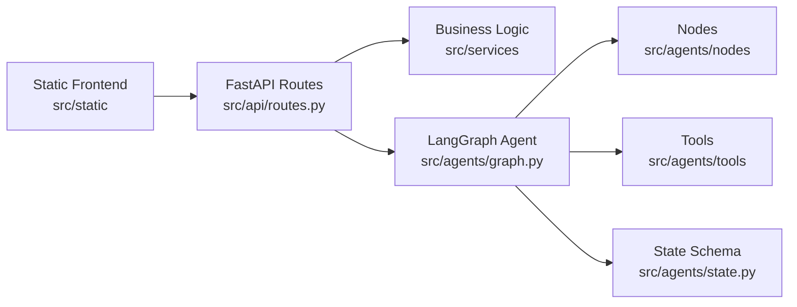

# Architecture Diagram

```mermaid
flowchart LR
    UI["Static Frontend\nsrc/static"] --> API["FastAPI Routes\nsrc/api/routes.py"]
    API --> Services["Business Logic\nsrc/services"]
    API --> Agent["LangGraph Agent\nsrc/agents/graph.py"]
    Agent --> Nodes["Nodes\nsrc/agents/nodes"]
    Agent --> Tools["Tools\nsrc/agents/tools"]
    Agent --> State["State Schema\nsrc/agents/state.py"]
```
